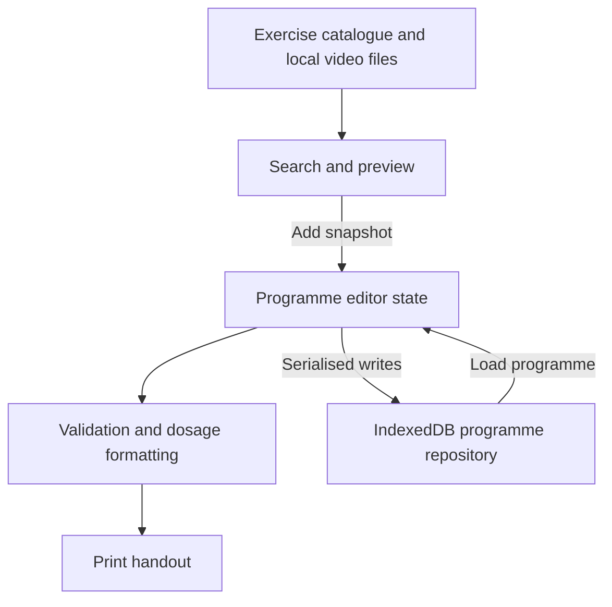
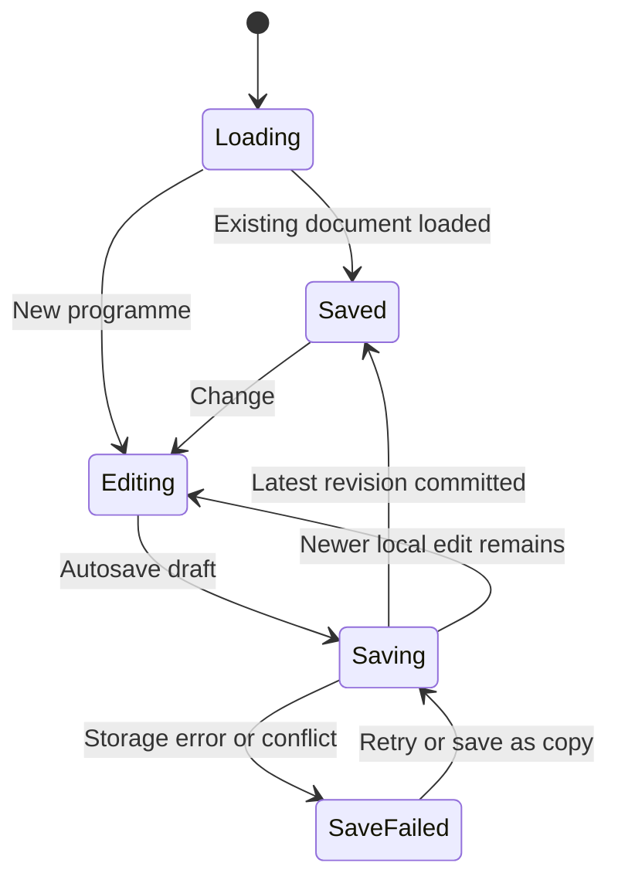

# MSK Rehab Builder MVP - Plan

## Goal Capsule

- **Objective:** MSK clinicians can assemble, personalise, save, and print a clear exercise programme during a consultation.
- **Means:** A searchable video library beside an inline programme editor (KTD1–KTD3).
- **Authority:** The user's request governs scope; Product Contract governs behaviour; Planning Contract governs implementation choices. Assumptions below are proposed defaults under the user's autonomy allowance.
- **Execution profile:** Build a local browser MVP and verify the complete workflow. This document is a plan, not evidence of implementation.
- **Stop conditions:** Surface a blocker if usable video rights cannot be established, or the work requires patient records or cloud services beyond this scope. The app shell can proceed while media is sourced, but a video-free demo cannot satisfy completion.
- **Tail ownership:** The implementing agent owns local implementation, validation, and delivery. Hosting, public release, and patient deployment are separate work.

---

## Product Contract

### Summary

Build a small clinician workspace with the exercise library on the left and the current programme on the right. Clinicians preview a video, add the exercise, and edit dosage without leaving the builder. Saved programmes can be reopened, duplicated, and printed with one readable layout.

### Problem Frame

During consultations, clinicians need to translate selected exercises into precise instructions quickly. The key product question is whether a focused workspace makes that task comfortable with fewer interruptions. The user named ExorLive as a reference; its existing feature coverage means differentiation must be demonstrated through workflow quality.

### Key Decisions

- **One focused workspace:** Keep selection and prescription close together. Governs R1–R5.
- **Local evaluation first:** Validate the workflow before adding account and patient administration. Governs R6, R9.
- **Small usable library:** Prioritise playable, relevant clips over catalogue size. Governs R2.

### Requirements

**Library**

- R1. Search exercise names, aliases, and tags, combining search with body-region and equipment filters. Clearing filters restores results without changing the programme.
- R2. Provide at least 12 distinct MSK exercise entries with matching playable videos, posters, concise written instructions, body-region tags, and equipment tags. Each entry must have recorded ownership or permission covering its intended use; do not reuse ExorLive media or descriptions.
- R3. Preview an exercise without losing search position or programme edits. A failed video shows written instructions and a retry action; only one video plays at a time.

**Programme builder**

- R4. Add, remove, duplicate, and reorder exercise instances independently. Support explicit move-up/down controls; dragging is optional polish.
- R5. Edit dosage inline per instance using optional fields in the parameter table below. Unset fields stay blank and are omitted from output; no clinical dosage is prefilled automatically.

| Parameter | Entry rule | Display meaning |
|---|---|---|
| Sets | Positive integer | Number of sets |
| Repetitions | Positive integer or ascending integer range | Repetitions per set, e.g. 8–12 |
| Duration | Positive number plus seconds/minutes | Time per set |
| Load | Nonnegative decimal kg | External load; zero is explicit, not blank |
| Hold | Positive number in seconds | Hold time per repetition |
| Rest | Nonnegative number in seconds | Rest between sets |
| Frequency | Short text | Clinician wording such as “every other day” |
| Side | Left, right, both, or unset | Side to perform |
| Tempo / effort | Short text | Clinician-entered cues; no interpretation |
| Custom parameter | Label and text value | Escape hatch for distance, band colour, or other needs |
| Exercise notes | Multiline text | Programme-specific instructions |

Common fields appear first; “Add parameter” exposes the rest. Sets, reps, time, and load may coexist. Decimal inputs accept comma or dot separators, then normalise consistently. Invalid values show a field-level error and block printing until corrected, while preserving the draft input.

**Save and output**

- R6. Create named programmes, autosave drafts on the same browser, reopen them, duplicate them, and delete them with confirmation. Show saving, saved, and failed-save states honestly; browser storage is not a backup or cross-device sync.
- R7. Print the current programme with title, general instructions, ordered exercises, images, written instructions, and all entered dosage fields. Use the browser print dialog for paper or Save as PDF; one layout is sufficient.
- R8. Block printing an empty programme or a programme with invalid fields and identify the problem. Printing must use current visible edits, not an older saved copy.

**Evaluation boundary and usability**

- R9. Make this release a single-browser evaluation tool for non-identifying programmes. Do not provide patient-name, diagnosis, contact, account, analytics, or sharing features; place a short “Do not enter patient details” note by programme text inputs.
- R10. Support keyboard search, add, edit, remove, and reorder actions with labelled controls and visible focus. Use a stacked library/builder view at narrow widths without discarding either panel's state.

### Key Flow

F1. Open a new programme → search/filter → preview → add → edit dosage → reorder → name → save → print → reopen later. Covers R1–R10.

### Acceptance Examples

- AE1. Covers R4–R5: add the same exercise twice, give one instance 3 sets of 8–12 reps at 7.5 kg and the other 2 sets of 30 seconds. Editing or removing either instance leaves the other unchanged.
- AE2. Covers R5, R7–R8: leave load blank on one exercise and explicitly enter 0 kg on another. The handout omits the first load and displays the second; an invalid repetition range prevents printing.
- AE3. Covers R6: after the saved indicator appears, reload and reopen the programme. Exercise order, custom labels, notes, and dosage remain intact. If storage fails, edits remain visible and the UI does not claim they were saved.
- AE4. Covers R3: a missing video displays a retry state and instructions; the clinician can still continue building without losing work.

### Success Criteria

Proposed validation target: after a short orientation, an MSK clinician can create and print a five-exercise programme with mixed dosage in under three minutes without assistance. This is a usability target, not an established advantage over ExorLive. Verify output accuracy separately: every entered parameter must survive save/reload and print.

### Scope Boundaries

Deferred: patient accounts, secure sharing/QR delivery, cloud sync, clinic teams, EHR integration, adherence tracking, analytics, billing, programme schedules, exercise upload UI, favourites, template marketplace, AI recommendations, and automatic progression. Programme duplication provides basic reuse in this release.

Diagnosis and autonomous treatment selection are outside this MVP. Clinicians supply the instructions; the tool does not judge their clinical suitability.

### Reference Findings

ExorLive supports combined text/filter search, exercise selection into programmes, an exercise editor with extensible data rows, and configurable print output. These capabilities establish the baseline, not evidence that ExorLive is slow or lacks the requested parameters.

- [Find exercises](https://support.exorlive.com/hc/en-gb/articles/360001246449-Find-exercises): informs R1's limited starting filter set.
- [Create program](https://support.exorlive.com/hc/en-gb/articles/360001249905-Create-program): supports the end-to-end workflow in F1.
- [Edit exercises in programs](https://support.exorlive.com/hc/en-gb/articles/360001249945-Edit-exercises-in-programs): motivates testing inline editing as an alternative to a separate editor.
- [Print program](https://support.exorlive.com/hc/en-gb/articles/360001250225-Print-program): supports R7 as a useful endpoint; richer layouts and video-link delivery remain deferred.

Sources reviewed on 2026-09-09 through public documentation, not an authenticated hands-on comparison.

---

## Planning Contract

### Assumptions

The first release is for workflow evaluation on one clinician's computer, in English with metric units. Patient delivery and deployment are not implied. Twelve exercises is a proposed starter floor, with coverage across upper limb, lower limb, and trunk rather than a complete clinical catalogue. The handout, autosave, and programme reuse are small scope additions that make the requested builder useful end to end.

The repository is empty apart from Git metadata; there is no existing application, dependency manifest, strategy document, or local learning corpus to follow. All implementation paths below are proposed.

### Key Technical Decisions

- KTD1. **React, TypeScript, and Vite with plain CSS.** A client application fits R1–R10 without introducing server operations. Pin compatible stable dependencies and a lockfile during setup, checking the installed runtime against [Vite's current requirements](https://vite.dev/guide/). Avoid a full-stack framework until server behaviour exists.
- KTD2. **One programme state owner with explicit actions.** Follow [React's state organisation guidance](https://react.dev/learn/managing-state) for add, edit, remove, and reorder actions. Keep form drafts in the same state model that feeds validation and output, preventing stale printing under R8.
- KTD3. **Separate catalogue entries from programme instances.** Each added item gets a unique instance ID and a snapshot of title, instructions, media reference, and catalogue revision. Prescription fields belong to the instance. This protects R4 and prevents catalogue edits from rewriting existing programmes silently.
- KTD4. **IndexedDB behind a small programme repository.** Store versioned programme documents, not video blobs, using [IndexedDB's asynchronous storage model](https://developer.mozilla.org/en-US/docs/Web/API/IndexedDB_API). Serialise writes per programme and use revisions to reject stale updates across tabs. On conflict, retain local edits and offer save-as-copy or reload; never overwrite silently. Mark “Saved” only after transaction completion. Unsupported or corrupt records are retained and reported, not reset automatically. Governs implementation of R6.
- KTD5. **Local rights-cleared media and a data manifest.** Ship the seed catalogue as data and clips under public assets, with a source/rights ledger. Use native video controls, posters, and on-demand loading. Do not build upload, scraping, transcoding, or third-party embeds. This keeps R2–R3 independent of external playback services.
- KTD6. **Shared display formatter and print stylesheet.** The editor summary and handout use the same validated dosage formatting. Hide editing controls in print, omit blank fields, and avoid splitting normal exercise cards across pages. Long notes must paginate without clipping. Governs R5, R7–R8.

### High-Level Technical Design

Programme documents contain an ID, schema version, revision, title, general instructions, ordered instances, and timestamps. Fields may retain incomplete raw input while editing; validation produces the display-ready projection for printing. No second independent print model is persisted.

### Risks and Dependencies

- **Media supply:** No usable clips exist in the repo today. During U1, source at least 12 relevant clips with documented permission and review them with an MSK clinician before clinical use. If unavailable, report the exact missing assets; never silently substitute unrelated or AI-generated movement demonstrations.
- **Local persistence:** Storage may be unavailable or cleared. R6's honest save states are essential; document the limitation in the README and avoid production-readiness claims.
- **Clinical content:** Technical validation proves field and output behaviour, not exercise suitability. Use neutral descriptions and clinician-entered dosage; media/content review remains distinct from software tests.
- **Free text:** R9 reduces intended data scope but cannot prevent someone typing patient information. Render all text as text, make no network uploads, and do not claim the local MVP provides clinical data governance.
- **Printing:** Browser print settings vary. Validate the supported browser's A4 output with both a short programme and long notes, including print-background settings disabled.

---

## Implementation Units

### U1. Establish the application and usable catalogue

**Goal:** Provide the runnable shell and the video content required by R2.

**Requirements:** R2, R9; KTD1, KTD5. **Dependencies:** None.

**Files:** `package.json`, lockfile, `index.html`, `vite.config.ts`, TypeScript configuration, `src/main.tsx`, `src/App.tsx`, `src/styles.css`, `src/data/exercises.ts`, `src/domain/exercise.ts`, `public/exercises/`, `docs/media-rights.md`, `README.md`, `src/data/exercises.test.ts`.

**Approach:** Bootstrap the application, define catalogue metadata, and populate matching media assets. Add a simple header with Library/Programme context and Saved programmes entry point. Record clip provenance and any attribution requirements.

**Patterns to follow:** Native HTML video and KTD1/KTD5; there are no existing project patterns.

**Test scenarios:**

1. Every catalogue entry has a unique ID, required metadata, a matching existing clip/poster, and a rights-ledger entry.
2. At least 12 distinct clips actually play in the target browser; incorrect movement/media pairings fail content QA.

**Verification:** App starts and builds; content meets R2. Record any outstanding clinician content-review limitation explicitly.

### U2. Search, filter, and preview exercises

**Goal:** Make the library usable without disrupting the builder.

**Requirements:** R1, R3, R10; AE4. **Dependencies:** U1.

**Files:** `src/features/library/ExerciseLibrary.tsx`, `ExerciseCard.tsx`, `VideoPreview.tsx` in the same folder, `src/features/library/search.ts`, `src/features/library/search.test.ts`, `src/features/library/ExerciseLibrary.test.tsx`.

**Approach:** Use local case-insensitive search over catalogue names, aliases, and tags. Combine filters predictably. Use a focus-managed preview dialog; retain search state when it closes.

**Patterns to follow:** KTD2/KTD5 and semantic form controls.

**Test scenarios:**

1. Search an alias while filtering region and equipment; only matching exercises appear, with a clear no-results state when none match.
2. Clear filters after previewing; search position and existing programme edits remain intact.
3. Covers AE4. Simulate an unavailable clip; instructions and retry remain available.
4. Open and close previews with the keyboard; focus returns to the launching card and prior playback stops.

**Verification:** R1/R3/R10 work with pointer and keyboard.

### U3. Build and prescribe a programme inline

**Goal:** Assemble independent exercise instances with flexible dosage.

**Requirements:** R4–R5, R8, R10; AE1–AE2. **Dependencies:** U1; integrate with U2.

**Files:** `src/domain/programme.ts`, `src/domain/parameters.ts`, `src/domain/programme.test.ts`, `src/domain/parameters.test.ts`, `src/features/builder/ProgrammeBuilder.tsx`, `PrescriptionCard.tsx`, `ParameterEditor.tsx`, `ProgrammeBuilder.test.tsx` in the same folder.

**Approach:** Implement KTD2/KTD3 with stable instance identity. Start with sets/reps inputs and reveal optional parameters on demand. Add title/general instructions and a one-action undo for the most recently removed exercise.

**Patterns to follow:** Pure domain actions and validation separate from React rendering.

**Test scenarios:**

1. Covers AE1. Duplicate exercise instances keep distinct dosage after edit, reorder, and removal.
2. Covers AE2. Preserve blank versus zero load; accept 7,5 and 7.5 kg, ascending rep ranges, and simultaneous duration/reps.
3. Reject negative load, fractional sets, and reversed rep ranges; preserve incomplete input while typing.
4. Add and remove a custom parameter; its label/value remain attached to the correct instance.
5. Reorder by keyboard and undo removal; restore the correct instance and dosage.

**Verification:** A mixed five-exercise programme can be built entirely inline, with unambiguous units and no shared-dose mutation.

### U4. Save, reopen, and reuse programmes

**Goal:** Preserve programme work accurately in the same browser.

**Requirements:** R6, R9; AE3. **Dependencies:** U3.

**Files:** `src/storage/programmeRepository.ts`, `src/storage/programmeRepository.test.ts`, `src/features/programmes/SavedProgrammes.tsx`, `src/features/programmes/useAutosave.ts`, `src/features/programmes/useAutosave.test.tsx`, `tests/programme-persistence.spec.ts`.

**Approach:** Implement KTD4, connect autosave state to the header, and provide new/open/duplicate/delete actions. Flush queued work before switching programmes; on failure offer retry or explicit discard instead of silently navigating away. Unsaved changes trigger a browser unload warning where supported.

**Patterns to follow:** One persistence adapter and per-programme revisions; UI never writes storage directly.

**Test scenarios:**

1. Covers AE3. Save, reload, and reopen with every field and order intact, including incomplete draft input.
2. Rapid edits followed by programme switching cannot let an older write replace the latest edit.
3. Simulated storage denial/quota failure leaves work visible and shows failure rather than “Saved”.
4. Two tabs update one revision; the second sees a conflict and can preserve its work as a copy.
5. Duplicate a saved programme; edits do not change its source. Cancel deletion leaves data intact; confirmed deletion removes only the selected programme.
6. An unsupported/corrupt stored document is reported and retained rather than silently overwritten.

**Verification:** Persistence round trips pass in a real browser, beyond mocked storage tests.

### U5. Produce the handout and verify the complete workflow

**Goal:** Deliver accurate, readable output from the current programme.

**Requirements:** R7–R10; F1, AE2. **Dependencies:** U2–U4.

**Files:** `src/features/print/ProgrammeHandout.tsx`, `src/features/print/print.css`, `src/domain/formatPrescription.ts`, `src/domain/formatPrescription.test.ts`, `tests/rehab-builder.spec.ts`, `tests/print-programme.spec.ts`, `README.md`.

**Approach:** Implement KTD6 with a print-preview surface. Include evaluation limitations and startup/verification instructions in README. Verify the proposed usability target with a clinician when available.

**Patterns to follow:** One validated data projection for editor summaries and handout, with CSS print rules.

**Test scenarios:**

1. Covers F1. Search, preview, add five exercises, edit mixed dosage, reorder, save, print, and reopen.
2. Covers AE2. Print includes custom fields and explicit zero values while omitting unset fields.
3. Print immediately after editing uses the latest visible values; empty/invalid programmes cannot print.
4. Long instructions and ten exercises paginate without clipping; short cards remain together when they fit a page.
5. At narrow width, switching library/builder views preserves state; the complete keyboard path remains usable.

**Verification:** Visually inspect an A4 PDF generated by the supported browser and complete the end-to-end browser tests. Record clinician usability measurement separately from automated verification.

---

## Verification Contract

No test commands exist yet. U1 must provide documented scripts for type checking, production build, unit/component tests, and browser tests; subsequent units extend those suites. Use Vitest/Testing Library for domain and component behaviour and Playwright for persistence and complete user flows, with versions chosen during setup.

Automated gates cover U1–U5's scenarios. Manual gates cover actual video playback/content matching, keyboard use, narrow-width layout, and A4 print inspection. The initial supported environment is current desktop Chrome/Edge; wider browser certification is deferred. Run checks appropriate to changed behaviour, not repeated full suites without cause.

The three-minute clinician exercise is a proposed product validation target. If no clinician is available, record it as unmeasured; do not label an agent walkthrough clinician validation.

---

## Definition of Done

- R1–R10 are implemented and each unit's verification outcomes pass.
- The library contains the usable clips required by R2, with documented rights.
- AE1–AE4 and the full programme-building flow pass, including real-browser save/reload and print checks.
- No known bug silently loses a prescription field or changes its meaning in output.
- README explains startup, verification, local-storage limits, and the evaluation boundary.
- Abandoned experiments and placeholder-only controls are removed.
- Unmeasured clinician usability and any pending clinical content review are stated explicitly; neither is claimed complete by software tests.
